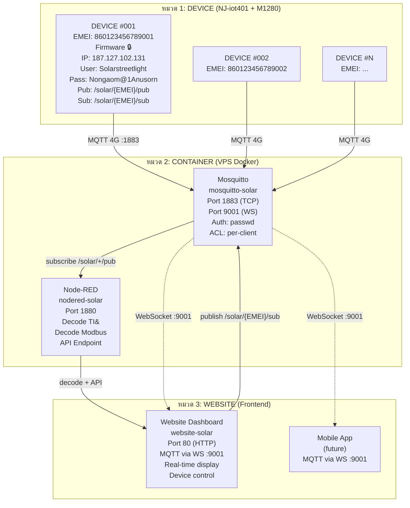

# คู่มือออกแบบระบบ Solar IoT
## Mosquitto MQTT Broker + Node-RED + Website
### รองรับ 1000 อุปกรณ์

---

## สารบัญ

### [หมวด 1: DEVICE](#หมวด-1-device)
1. [ข้อมูลอุปกรณ์ (Device)](#1-ข้อมูลอุปกรณ์-device)
2. [Firmware Hardcode](#2-firmware-hardcode)
3. [Device Protocol](#3-device-protocol)

### [หมวด 2: CONTAINER](#หมวด-2-container)
4. [ภาพรวม Container](#4-ภาพรวม-container)
5. [โครงสร้างไฟล์](#5-โครงสร้างไฟล์)
6. [mosquitto.conf](#6-mosquittoconf)
7. [aclfile](#7-aclfile)
8. [docker-compose.yml](#8-docker-composeyml)
9. [Node-RED Setup](#9-node-red-setup)
10. [ขั้นตอนการติดตั้ง](#10-ขั้นตอนการติดตั้ง)
11. [คำสั่งที่ใช้บ่อย](#11-คำสั่งที่ใช้บ่อย)
12. [การ Backup และ Restore](#12-การ-backup-และ-restore)
13. [การแก้ปัญหา](#13-การแก้ปัญหา)

### [หมวด 3: WEBSITE](#หมวด-3-website)
14. [ภาพรวม Website](#14-ภาพรวม-website)
15. [WebSocket MQTT Config](#15-websocket-mqtt-config)
16. [Website User & ACL](#16-website-user--acl)
17. [Website Architecture](#17-website-architecture)
18. [API Node-RED สำหรับ Website](#18-api-node-red-สำหรับ-website)
19. [ตัวอย่าง Code เชื่อมต่อ MQTT](#19-ตัวอย่าง-code-เชื่อมต่อ-mqtt)

---

## หมวด 1: DEVICE

---

## 1. ข้อมูลอุปกรณ์ (Device)

### การแยก Device ด้วย EMEI

Device แต่ละตัวถูกระบุด้วย **EMEI** (ค่าอ้างอิงจาก Serial Number ที่โรงงาน)

**ตารางตรวจสอบ EMEI จาก SN (ได้รับจากโรงงาน):**

| Serial Number (SN) | EMEI | Device Name | Status |
|-------------------|------|-------------|--------|
| `njc7d6pBulDDfBBa2025050870002968` | `864865083327800` | device-01 | Active |
| `njuxAJIxAnz2TkqY2025050870751562` | `867920075008640` | device-02 | Active |
| `njfJ4FhLDCiZzZbB2025050857732596` | `864865083329673` | equipment2596 | Active |

> EMEI = ค่า identifier ของ device module ที่ใช้อ้างอิงใน MQTT (`ClientID = EMEI`)

### อุปกรณ์ที่ใช้งาน

| Device | EMEI | Hardware | Protocol |
|--------|------|----------|----------|
| equipment2596 | `864865083329673` | NJ-iot401 + M1280 | Custom TI& Binary |
| device-01 | `864865083327800` | NJ-iot401 + M1280 | Custom TI& Binary |
| device-02 | `867920075008640` | NJ-iot401 + M1280 | Custom TI& Binary |

### สถาปัตยกรรม Hardware

```
M1280 (Solar Charge Controller)
  ├── Solar Panel (PV Input)
  ├── Battery 12V / 24V
  └── LED Street Light Load
        │ RS485 (9600, 8N1, Modbus RTU)
        ▼
NJ-iot401 (4G Module — Modbus Master)
  ├── อ่านค่า M1280 ผ่าน Modbus RTU
  └── ส่งข้อมูลขึ้น Cloud ผ่าน MQTT (4G Cat.1)
```

---

## 2. Firmware Hardcode

ค่าเหล่านี้ถูก **Hardcode ใน Firmware ของ NJ-iot401** — แก้ไขไม่ได้ถ้าไม่อัปเดต firmware ทีละ device

```
┌──────────────────────────────────────────┐
│           FIRMWARE HARDCODE 🔒            │
│                                          │
│  IP:    187.127.102.131                  │
│  Port:  1883                             │
│  User:  Solarstreetlight                 │
│  Pass:  Nongaom@1Anusorn                │
│  Pub:   /solar/{EMEI}/pub                │
│  Sub:   /solar/{EMEI}/sub                │
│  ClientID = EMEI                         │
│  QoS:   0                                │
│  Keep:  240s                             │
└──────────────────────────────────────────┘
```

| ข้อจำกัด | ค่า Hardcode | ผลกระทบ |
|----------|--------------|---------|
| Broker IP | `187.127.102.131:1883` | เปลี่ยน IP ไม่ได้ — ต้อง firmware update 1000 device |
| UserMQTT | `Solarstreetlight` (shared) | แยก device ด้วย **ClientID = EMEI (%c)** ไม่ใช่ username |
| PassMQTT | `Nongaom@1Anusorn` (shared) | Single entry ใน passwd file |
| ClientID | `{EMEI}` | Device identifier — ใช้ `%c` ใน ACL pattern |
| Topic Pub | `/solar/{EMEI}/pub` | เปลี่ยน format ไม่ได้ |
| Topic Sub | `/solar/{EMEI}/sub` | เปลี่ยน format ไม่ได้ |
| QoS | 0 | `queue_qos0_messages false` |
| Keepalive | 240s | Mosquitto check ทุก 60s |
| SN → EMEI | มีตารางจากโรงงาน | ใช้ SN เพื่อค้นหา EMEI สำหรับ device management |

---

## 3. Device Protocol

### equipment2596 — TI& Binary Protocol

```
Header (15 bytes):
  Byte 0-3:  Start marker = 0x54492606 ("TI&\x06")
  Byte 13:   Message Type = 4 (Full) / 16 (Short)

Full Telemetry (56 bytes, type=4):
  Bytes 15-16: Solar Panel Voltage  (uint16 BE ÷ 170.7)  ✅
  Bytes 17-18: Battery Voltage      (uint16 BE ÷ 170.7)  ✅
  Bytes 19-20: Load Voltage         (uint16 BE ÷ 170.7)  ✅
  Byte 32:     Daily Discharge                           ✅
  Byte 36:     Daily Charge                              ✅
  Bytes -2:    CRC (algorithm TBD)                       ❌
  TBD:         Current, Temperature, SOC                 ❌
```

### NJ-iot401 — Modbus RTU Frame

```
Modbus RTU Response (FC 03, Read 32 registers 0x3000-0x3020):

  Byte 0:    Slave ID    = 0x01
  Byte 1:    Function    = 0x03
  Byte 2:    Byte Count  = 0x40 (64 bytes = 32 regs)
  Bytes 3+:  Register Data (32 registers × 2 bytes)
  Bytes -2:  CRC16-Modbus

Register Map:
  0x3000: PV Voltage       (÷ 100 = V)
  0x3001: PV Current       (÷ 100 = A)
  0x3002: PV Power Lo
  0x3003: PV Power Hi
  0x3004: Battery Voltage  (÷ 100 = V)
  0x3005: Battery Current  (÷ 100 = A)
  ...
  0x300C: Daily Yield
```

---

## หมวด 2: CONTAINER

---

## 4. ภาพรวม Container

```
VPS (187.127.102.131)
  │
  ├── Container 1: mosquitto-solar
  │     Image: eclipse-mosquitto:2.0.18
  │     Port:  1883 (MQTT TCP), 9001 (MQTT WebSocket)
  │     Volume: /opt/mosquitto/
  │     Role:  MQTT Broker — รับ data จาก device, ACL, Persist
  │
  ├── Container 2: nodered-solar
  │     Image: nodered/node-red:4.0.2
  │     Port:  1880 (Web UI)
  │     Volume: /opt/mosquitto/nodered/
  │     Role:  Subscribe MQTT → Decode Binary → Process → Output
  │
  ├── Container 3: website (optional)
  │     Role:  Frontend — แสดงข้อมูล, ควบคุม device ผ่าน MQTT
  │     Port:  3000 (Web App)
```

---

## 5. โครงสร้างไฟล์

```
/opt/mosquitto/
│
├── config/                          # Mosquitto Config
│   ├── mosquitto.conf
│   ├── aclfile
│   └── passwd
│
├── data/                            # Mosquitto Persistence
│   └── mosquitto.db
│
├── log/                             # Mosquitto Logs
│   └── mosquitto.log
│
├── nodered/                         # Node-RED
│   ├── data/
│   │   ├── flows.json
│   │   ├── flows_cred.json
│   │   └── settings.js
│   └── lib/decoders/
│       ├── ti_protocol.js
│       └── modbus_rtu_decoder.js
│
├── website/                         # Website (Frontend)
│   ├── index.html
│   ├── app.js
│   └── mqtt-config.js
│
└── docker-compose.yml
```

---

## 6. mosquitto.conf

```ini
# ============================================
# Mosquitto MQTT Broker — Solar IoT
# รองรับ 1000 Devices
# Broker: 187.127.102.131:1883
# ============================================

# --- MQTT TCP ---
listener 1883 0.0.0.0
max_connections 2000
socket_domain ipv4

# --- MQTT WebSocket (สำหรับ Website) ---
listener 9001 0.0.0.0
protocol websockets
max_connections 500
socket_domain ipv4

# --- Authentication ---
allow_anonymous false
password_file /mosquitto/config/passwd

# --- Authorization ---
acl_file /mosquitto/config/aclfile

# --- Performance ---
set_tcp_nodelay true

# --- Session Limits ---
max_inflight_messages 20
max_queued_messages 1000
queue_qos0_messages false
message_size_limit 10485760
retry_interval 20

# --- Persistence ---
persistence true
persistence_location /mosquitto/data/
persistence_file mosquitto.db
autosave_interval 1800

# --- Monitoring ---
sys_interval 30
connection_messages true

# --- Logging ---
log_dest file /mosquitto/log/mosquitto.log
log_dest stdout
log_type error
log_type warning
log_type notice
log_timestamp true
```

---

## 7. aclfile

```
# ============================================
# ACL — Solar Device — 3 หมวด
# หมวด 1: Device — publish/subscribe ของตัวเอง
# หมวด 2: Node-RED — subscribe ทั้งหมด
# หมวด 3: Website — subscribe + publish command
# ============================================

# ===== หมวด 1: DEVICE =====
# %c = ClientID (= EMEI device identifier)
# %u = Username (= Solarstreetlight, shared)

pattern write /solar/%c/pub
pattern read /solar/%c/sub

# ===== หมวด 2: NODE-RED =====
user nodered
topic read /solar/+/pub

# ===== หมวด 3: WEBSITE =====
user website
topic read /solar/+/pub
topic write /solar/+/sub
```

### ตาราง ACL สรุป

| ClientID / User | Publish | Subscribe |
|-----------------|---------|-----------|
| Device `860123456789001` | `/solar/860123456789001/pub` | `/solar/860123456789001/sub` |
| Device `860123456789002` | `/solar/860123456789002/pub` | `/solar/860123456789002/sub` |
| User `nodered` | — | `/solar/+/pub` |
| User `website` | `/solar/+/sub` | `/solar/+/pub` |

---

## 8. docker-compose.yml

```yaml
services:
  # ===== Container 1: Mosquitto MQTT Broker =====
  mosquitto:
    image: eclipse-mosquitto:2.0.18
    container_name: mosquitto-solar
    restart: unless-stopped
    hostname: mosquitto-solar

    ports:
      - "1883:1883"     # MQTT TCP (devices + Node-RED)
      - "9001:9001"     # MQTT WebSocket (website)

    volumes:
      - ./config:/mosquitto/config:ro
      - ./data:/mosquitto/data:rw
      - ./log:/mosquitto/log:rw

    ulimits:
      nofile:
        soft: 100000
        hard: 100000

    healthcheck:
      test: ["CMD", "mosquitto_sub", "-h", "localhost", "-t", "$$SYS/broker/uptime", "-C", "1"]
      interval: 30s
      timeout: 10s
      retries: 3
      start_period: 10s

    networks:
      - iot-net

  # ===== Container 2: Node-RED =====
  nodered:
    image: nodered/node-red:4.0.2
    container_name: nodered-solar
    restart: unless-stopped
    hostname: nodered-solar

    ports:
      - "1880:1880"     # Node-RED Editor UI

    volumes:
      - ./nodered/data:/data
      - ./nodered/lib/decoders:/data/decoders

    environment:
      - TZ=Asia/Bangkok
      - NODE_RED_CREDENTIAL_SECRET=change-this-to-random-string

    depends_on:
      mosquitto:
        condition: service_healthy

    networks:
      - iot-net

  # ===== Container 3: Website (Frontend) =====
  # ใช้ Nginx หรือ Node.js serve static files
  # เชื่อมต่อ MQTT via WebSocket → mosquitto-solar:9001
  website:
    image: nginx:alpine
    container_name: website-solar
    restart: unless-stopped

    ports:
      - "80:80"         # HTTP (หรือ 443 ถ้ามี SSL)
      - "3000:3000"     # Web App

    volumes:
      - ./website:/usr/share/nginx/html:ro

    depends_on:
      - mosquitto
      - nodered

    networks:
      - iot-net

networks:
  iot-net:
    driver: bridge
```

---

## 9. Node-RED Setup

### 9.1 สร้าง MQTT Users

```bash
# User สำหรับ Node-RED
docker exec -it mosquitto-solar mosquitto_passwd /mosquitto/config/passwd nodered
# Enter password: (ตั้งเอง)

# User สำหรับ Website
docker exec -it mosquitto-solar mosquitto_passwd /mosquitto/config/passwd website
# Enter password: (ตั้งเอง)

docker kill --signal=HUP mosquitto-solar
```

### 9.2 Node-RED Flow — Subscribe + Decode

Node-RED auto-save ที่ `/opt/mosquitto/nodered/data/flows.json`

**Flow หลัก:**

```
[MQTT In: /solar/+/pub]
        │
        ▼
[Function: Decode Binary]
  ├── TI& Protocol → { solar_v, battery_v, load_v, daily }
  └── Modbus RTU  → { pv, battery, load, temp }
        │
        ▼
[Debug Output]   ← ดู results ใน Node-RED Debug tab
        │
        ▼
[HTTP Response]  ← ส่งข้อมูลให้ Website ผ่าน HTTP API
```

### 9.3 Decoder Functions

**`/opt/mosquitto/nodered/lib/decoders/ti_protocol.js`** — ถอดรหัส TI&:

```javascript
const V_SCALE = 170.7;

function decodeTIProtocol(data) {
    const msgType = data[13];
    if (msgType !== 4 || data.length < 56) {
        return { type: 'short_status', msgType };
    }
    return {
        type: 'full_telemetry',
        solar_voltage_v:  ((data[15] << 8) | data[16]) / V_SCALE,
        battery_voltage_v:((data[17] << 8) | data[18]) / V_SCALE,
        load_voltage_v:   ((data[19] << 8) | data[20]) / V_SCALE,
        daily_discharge:   data[32],
        daily_charge:      data[36],
        raw: data.toString('hex')
    };
}
module.exports = { decodeTIProtocol };
```

**`/opt/mosquitto/nodered/lib/decoders/modbus_rtu_decoder.js`** — ถอดรหัส Modbus:

```javascript
function decodeModbusRTU(data) {
    const registers = [];
    for (let i = 0; i < data.length - 4; i += 2) {
        registers.push((data[3 + i] << 8) | data[4 + i]);
    }
    return {
        pv_voltage:      registers[0] / 100,
        pv_current:      registers[1] / 100,
        battery_voltage: registers[4] / 100,
        battery_current: registers[5] / 100,
        load_voltage:    registers[7] / 100,
        load_current:    registers[8] / 100,
        battery_temp:    registers[10],
        device_temp:     registers[11],
        raw: data.toString('hex')
    };
}
module.exports = { decodeModbusRTU };
```

---

## 10. ขั้นตอนการติดตั้ง

### ขั้นที่ 1: SSH

```bash
ssh root@187.127.102.131
# Password: Nongoam@1Anusorn
```

### ขั้นที่ 2: สร้าง Directory

```bash
mkdir -p /opt/mosquitto/{config,data,log}
mkdir -p /opt/mosquitto/nodered/{data,lib/decoders}
mkdir -p /opt/mosquitto/website
chown -R 1883:1883 /opt/mosquitto/data /opt/mosquitto/log
```

### ขั้นที่ 3: สร้าง Config Files

ใช้ `cat` หรือ `nano` สร้าง:
- `/opt/mosquitto/config/mosquitto.conf`
- `/opt/mosquitto/config/aclfile`
- `/opt/mosquitto/docker-compose.yml`

### ขั้นที่ 4: สร้าง Passwords

```bash
touch /opt/mosquitto/config/passwd
chmod 600 /opt/mosquitto/config/passwd

docker run --rm -v /opt/mosquitto/config/passwd:/passwd eclipse-mosquitto:2.0.18 \
  mosquitto_passwd -b /passwd "Solarstreetlight" "Nongaom@1Anusorn"

docker run --rm -v /opt/mosquitto/config/passwd:/passwd eclipse-mosquitto:2.0.18 \
  mosquitto_passwd -b /passwd "nodered" "nodered-password"

docker run --rm -v /opt/mosquitto/config/passwd:/passwd eclipse-mosquitto:2.0.18 \
  mosquitto_passwd -b /passwd "website" "website-password"
```

### ขั้นที่ 5: Linux Kernel

```bash
cat >> /etc/sysctl.conf << 'EOF'
fs.file-max = 100000
net.core.somaxconn = 4096
net.ipv4.tcp_max_syn_backlog = 8192
net.ipv4.tcp_tw_reuse = 1
net.ipv4.tcp_fin_timeout = 30
net.ipv4.tcp_keepalive_time = 600
net.ipv4.ip_local_port_range = 1024 65535
net.core.rmem_max = 65536
net.core.wmem_max = 65536
net.ipv4.tcp_rmem = 4096 16384 65536
net.ipv4.tcp_wmem = 4096 16384 65536
EOF
sysctl -p
```

### ขั้นที่ 6: Docker

```bash
curl -fsSL https://get.docker.com | sh
```

### ขั้นที่ 7: รัน

```bash
cd /opt/mosquitto
docker network create iot-net 2>/dev/null || true
docker compose up -d
```

### ขั้นที่ 8: ตรวจสอบ

```bash
docker ps
docker logs mosquitto-solar --tail 5
docker logs nodered-solar --tail 5
docker logs website-solar --tail 5

# ทดสอบ MQTT
mosquitto_pub -h 187.127.102.131 -t "/solar/860123456789001/pub" -m "test" \
  -u "Solarstreetlight" -P "Nongaom@1Anusorn" -i "860123456789001"

# ดู Node-RED: http://187.127.102.131:1880
# ดู Website:  http://187.127.102.131
```

---

## 11. คำสั่งที่ใช้บ่อย

### Docker

| คำสั่ง | คำอธิบาย |
|--------|----------|
| `docker compose -f /opt/mosquitto/docker-compose.yml up -d` | เริ่มทั้งหมด |
| `docker compose -f /opt/mosquitto/docker-compose.yml down` | หยุดทั้งหมด |
| `docker compose -f /opt/mosquitto/docker-compose.yml logs -f` | Log ทั้งหมด |
| `docker ps --filter name=solar` | Container ของ solar |
| `docker kill --signal=HUP mosquitto-solar` | Reload Mosquitto |

### Monitor

```bash
docker exec mosquitto-solar mosquitto_sub -h localhost -t '$SYS/broker/clients/active' -C 1
ss -tan | grep :1883 | wc -l
```

---

## 12. การ Backup และ Restore

### Backup

```bash
tar -czf /root/backup-$(date +%Y%m%d).tar.gz \
  /opt/mosquitto/config \
  /opt/mosquitto/data \
  /opt/mosquitto/nodered \
  /opt/mosquitto/website
```

### Restore

```bash
docker compose -f /opt/mosquitto/docker-compose.yml down
mv /opt/mosquitto /opt/mosquitto.old
tar -xzf /root/backup-20250101.tar.gz -C /
chown -R 1883:1883 /opt/mosquitto/data /opt/mosquitto/log
docker compose -f /opt/mosquitto/docker-compose.yml up -d
```

### Cron (ทุกวัน 02:00)

```bash
crontab -e
0 2 * * * tar -czf /backups/solar-$(date +\%Y\%m\%d).tar.gz /opt/mosquitto
0 3 * * * find /backups -name "solar-*.tar.gz" -mtime +30 -delete
```

---

## 13. การแก้ปัญหา

| ปัญหา | สาเหตุ | วิธีแก้ |
|-------|--------|--------|
| Container restart ตลอด | passwd ไม่มี หรือเป็น directory | `touch passwd && chmod 600` |
| Device เชื่อมต่อไม่ได้ | Firewall port 1883 | `iptables -A INPUT -p tcp --dport 1883 -j ACCEPT` |
| Device Auth Failed | user ไม่มีใน passwd | สร้าง `Solarstreetlight` ใน passwd |
| ACL Denied | topic ไม่ถูกต้อง | ตรวจสอบ aclfile + `kill -HUP` |
| Node-RED ไม่รับ MQTT | user nodered ไม่มี | สร้าง user + reload |
| Website WebSocket Error | user website ไม่มี | สร้าง user + reload |
| Website เปิดไม่ได้ | Firewall port 80/3000 | เปิด firewall |

---

## หมวด 3: WEBSITE

---

## 14. ภาพรวม Website

Website เชื่อมต่อกับ Mosquitto ผ่าน **MQTT over WebSocket** (port 9001) เพื่อ:

### ความสามารถ

| ฟังก์ชัน | คำอธิบาย |
|----------|----------|
| แสดงข้อมูล real-time | Solar V, Battery V, Load V จากทุก device |
| Dashboard | กราฟ + ตารางแสดงสถานะ |
| ควบคุม device | ส่งคำสั่ง ON/OFF ผ่าน `/solar/{IMEI}/sub` |
| ประวัติข้อมูล | ดูข้อมูลย้อนหลัง (จาก Node-RED API) |

### การเชื่อมต่อ

```
Website (Browser)
  │
  ├── MQTT over WebSocket → ws://187.127.102.131:9001
  │     └── Subscribe: /solar/+/pub (รับข้อมูล real-time)
  │     └── Publish:   /solar/{IMEI}/sub (ส่งคำสั่ง)
  │
  └── HTTP REST API → http://187.127.102.131:1880/api/
        └── ดูประวัติ, ข้อมูลย้อนหลัง (optional)
```

---

## 15. WebSocket MQTT Config

### ใน mosquitto.conf — เพิ่ม Listener WebSocket แล้ว

```ini
# (อยู่ใน mosquitto.conf แล้ว — ข้อ 6)
listener 9001 0.0.0.0
protocol websockets
max_connections 500
```

### Website เชื่อมต่อ MQTT via WebSocket

```javascript
// mqtt-config.js — ตั้งค่าเชื่อมต่อ Website กับ Mosquitto

const MQTT_CONFIG = {
    // WebSocket endpoint ของ Mosquitto
    endpoint: 'ws://187.127.102.131:9001',
    
    // Credentials (สร้างใน passwd file)
    username: 'website',
    password: 'website-password-here',
    
    // Topics
    topics: {
        subscribe: '/solar/+/pub',      // รับ data จากทุก device
        command:   '/solar/{IMEI}/sub'  // ส่งคำสั่งควบคุม
    },
    
    // Connection options
    options: {
        clientId: 'website-dashboard-' + Math.random().toString(36).substr(2, 8),
        clean: true,
        keepalive: 60,
        reconnectPeriod: 5000,  // auto reconnect ทุก 5 วินาที
        connectTimeout: 10000
    }
};
```

---

## 16. Website User & ACL

### User ใน passwd

```bash
docker exec -it mosquitto-solar mosquitto_passwd /mosquitto/config/passwd website
# Enter password: website-password-here
docker kill --signal=HUP mosquitto-solar
```

### ACL (ใน aclfile แล้ว — ข้อ 7)

```
# Website — อ่าน data ทุกตัว + ส่งคำสั่ง
user website
topic read /solar/+/pub
topic write /solar/+/sub
```

Website สามารถ:
- `subscribe /solar/+/pub` → รับข้อมูลจาก device ทั้งหมดแบบ real-time
- `publish /solar/860123456789001/sub` → ส่งคำสั่งปิด/เปิด device #001
- ไม่สามารถ publish device data (เฉพาะรับ) — security

---

## 17. Website Architecture

### Frontend Components

```
website/
├── index.html          # หน้า Dashboard
├── dashboard.html      # แสดงข้อมูล real-time (MQTT)
├── control.html        # ควบคุม device
├── history.html        # ดูประวัติ (HTTP API)
│
├── css/
│   └── style.css
│
├── js/
│   ├── mqtt-config.js  # ตั้งค่า MQTT connection
│   ├── mqtt-client.js  # จัดการ MQTT connect/subscribe/publish
│   ├── dashboard.js    # แสดงข้อมูล device
│   └── control.js      # ส่งคำสั่งควบคุม
│
└── lib/
    └── mqtt.min.js     # MQTT.js library (over WebSocket)
```

### MQTT.js Library

Website ใช้ [MQTT.js](https://github.com/mqttjs/MQTT.js) สำหรับเชื่อมต่อ MQTT over WebSocket

```html
<!-- index.html -->
<script src="https://unpkg.com/mqtt/dist/mqtt.min.js"></script>
<script src="js/mqtt-config.js"></script>
<script src="js/mqtt-client.js"></script>
```

---

## 18. API Node-RED สำหรับ Website

Node-RED ส่งข้อมูลที่ decode แล้วให้ Website ผ่าน HTTP endpoint:

### Node-RED HTTP Endpoints

| Endpoint | Method | คำอธิบาย |
|----------|--------|----------|
| `/api/devices` | GET | รายการ device ทั้งหมด |
| `/api/device/{IMEI}/latest` | GET | ข้อมูลล่าสุดของ device |
| `/api/device/{IMEI}/history` | GET | ข้อมูลย้อนหลัง |
| `/api/device/{IMEI}/command` | POST | ส่งคำสั่ง (ON/OFF) |

### Website เรียก API

```javascript
// เรียกจาก Website
fetch('http://187.127.102.131:1880/api/devices')
  .then(res => res.json())
  .then(devices => {
      console.log('Devices:', devices);
  });

// ส่งคำสั่ง
fetch('http://187.127.102.131:1880/api/device/860123456789001/command', {
    method: 'POST',
    headers: { 'Content-Type': 'application/json' },
    body: JSON.stringify({ action: 'set_load', value: 1 })
});
```

---

## 19. ตัวอย่าง Code เชื่อมต่อ MQTT

### mqtt-client.js — จัดการการเชื่อมต่อ

```javascript
// mqtt-client.js
// จัดการ MQTT over WebSocket สำหรับ Website Solar Dashboard

class SolarMQTT {
    constructor(config) {
        this.config = config;
        this.devices = {};  // เก็บข้อมูลล่าสุดของแต่ละ device
        this.client = null;
    }

    connect() {
        this.client = mqtt.connect(this.config.endpoint, {
            clientId: this.config.options.clientId,
            username: this.config.username,
            password: this.config.password,
            clean: this.config.options.clean,
            keepalive: this.config.options.keepalive,
            reconnectPeriod: this.config.options.reconnectPeriod,
            connectTimeout: this.config.options.connectTimeout
        });

        this.client.on('connect', () => {
            console.log('✅ Connected to MQTT Broker via WebSocket');
            // Subscribe รับข้อมูลจากทุก device
            this.client.subscribe(this.config.topics.subscribe);
            this.updateStatus('connected');
        });

        this.client.on('message', (topic, payload) => {
            // topic = /solar/{IMEI}/pub
            const imei = topic.split('/')[2];
            const data = JSON.parse(payload.toString());
            
            // เก็บข้อมูลล่าสุด
            this.devices[imei] = {
                ...data,
                timestamp: new Date().toISOString()
            };
            
            // อัปเดต Dashboard
            this.updateDashboard(imei, this.devices[imei]);
        });

        this.client.on('close', () => {
            console.log('❌ Disconnected');
            this.updateStatus('disconnected');
        });

        this.client.on('error', (err) => {
            console.error('MQTT Error:', err);
            this.updateStatus('error');
        });
    }

    // ส่งคำสั่งไปยัง device
    sendCommand(imei, command) {
        const topic = this.config.topics.command.replace('{IMEI}', imei);
        this.client.publish(topic, JSON.stringify(command));
        console.log(`📤 Command sent to ${imei}:`, command);
    }

    // อัปเดต UI (implement ใน dashboard.js)
    updateDashboard(imei, data) {
        if (window.updateDeviceCard) {
            window.updateDeviceCard(imei, data);
        }
    }

    // อัปเดตสถานะ connection
    updateStatus(status) {
        if (window.updateConnectionStatus) {
            window.updateConnectionStatus(status);
        }
    }
}

// ===== เริ่มต้น =====
const solarMQTT = new SolarMQTT(MQTT_CONFIG);
solarMQTT.connect();
```

### dashboard.js — แสดงข้อมูล

```javascript
// dashboard.js

function updateDeviceCard(imei, data) {
    const card = document.getElementById(`device-${imei}`);
    if (!card) return;

    card.querySelector('.solar-v').textContent = data.solar_voltage_v?.toFixed(2) || '--';
    card.querySelector('.battery-v').textContent = data.battery_voltage_v?.toFixed(2) || '--';
    card.querySelector('.load-v').textContent = data.load_voltage_v?.toFixed(2) || '--';
    card.querySelector('.time').textContent = new Date(data.timestamp).toLocaleTimeString('th-TH');
}

function updateConnectionStatus(status) {
    const badge = document.getElementById('connection-badge');
    const statusMap = {
        'connected':    { text: '🟢 Connected',    class: 'badge-success' },
        'disconnected': { text: '🔴 Disconnected', class: 'badge-danger' },
        'error':        { text: '🟡 Error',         class: 'badge-warning' }
    };
    const s = statusMap[status] || statusMap.disconnected;
    badge.textContent = s.text;
    badge.className = s.class;
}
```

### control.js — ควบคุม Device

```javascript
// control.js

function turnOn(imei) {
    solarMQTT.sendCommand(imei, { action: 'set_load', value: 1 });
    showToast(`ส่งคำสั่ง ON ไปยัง ${imei}`);
}

function turnOff(imei) {
    solarMQTT.sendCommand(imei, { action: 'set_load', value: 0 });
    showToast(`ส่งคำสั่ง OFF ไปยัง ${imei}`);
}
```

### ตัวอย่าง HTML Dashboard

```html
<!DOCTYPE html>
<html>
<head>
    <title>Solar Dashboard</title>
    <script src="https://unpkg.com/mqtt/dist/mqtt.min.js"></script>
    <script src="js/mqtt-config.js"></script>
    <script src="js/mqtt-client.js"></script>
    <script src="js/dashboard.js"></script>
    <script src="js/control.js"></script>
</head>
<body>
    <h1>☀️ Solar IoT Dashboard</h1>
    <p>สถานะ: <span id="connection-badge" class="badge-danger">🔴 Disconnected</span></p>
    
    <div id="devices">
        <!-- Device card จะถูกสร้างโดย JavaScript -->
        <div id="device-860123456789001" class="device-card">
            <h3>Device #001 <small>EMEI: 860123456789001</small></h3>
            <p>☀️ Solar: <span class="solar-v">--</span> V</p>
            <p>🔋 Battery: <span class="battery-v">--</span> V</p>
            <p>💡 Load: <span class="load-v">--</span> V</p>
            <p>🕐 อัปเดต: <span class="time">--</span></p>
            <button onclick="turnOn('860123456789001')">🔛 ON</button>
            <button onclick="turnOff('860123456789001')">🔴 OFF</button>
        </div>
    </div>

    <script>
        // เริ่มต้นเมื่อหน้าโหลด
        document.addEventListener('DOMContentLoaded', () => {
            window.solarMQTT = new SolarMQTT(MQTT_CONFIG);
            window.solarMQTT.connect();
        });
    </script>
</body>
</html>
```

---

## สถาปัตยกรรมระบบ — 3 หมวด



### สรุป 3 หมวด

| หมวด | Components | Port | บทบาท |
|------|-----------|------|--------|
| **1: DEVICE** | NJ-iot401 + M1280 | — | ส่งข้อมูล MQTT ผ่าน 4G |
| **2: CONTAINER** | Mosquitto (1883/9001) + Node-RED (1880) | 1883, 9001, 1880 | Broker + Decode + API |
| **3: WEBSITE** | Nginx + HTML/JS Dashboard | 80/3000 | แสดงข้อมูล + ควบคุม |
